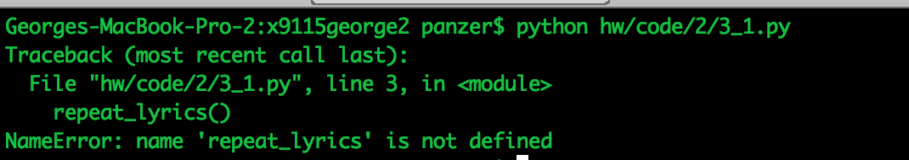
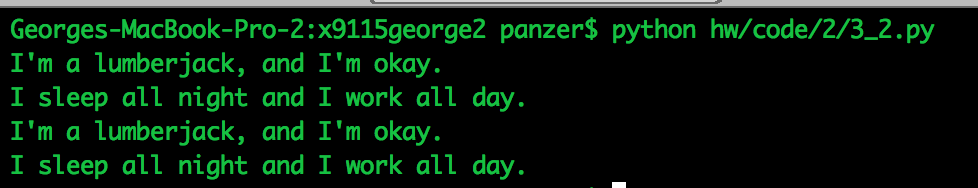
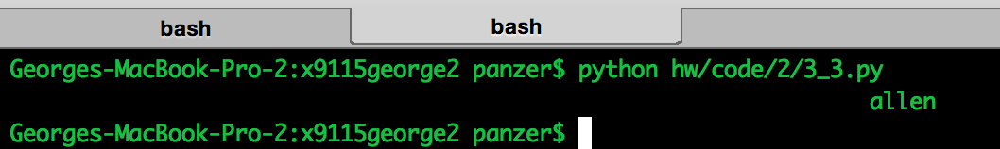
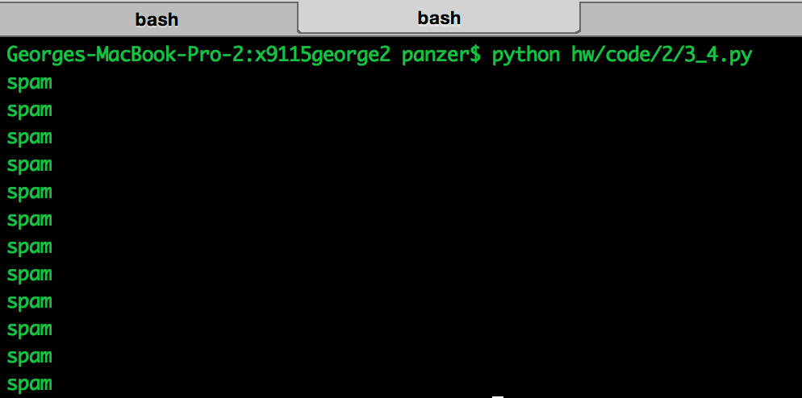
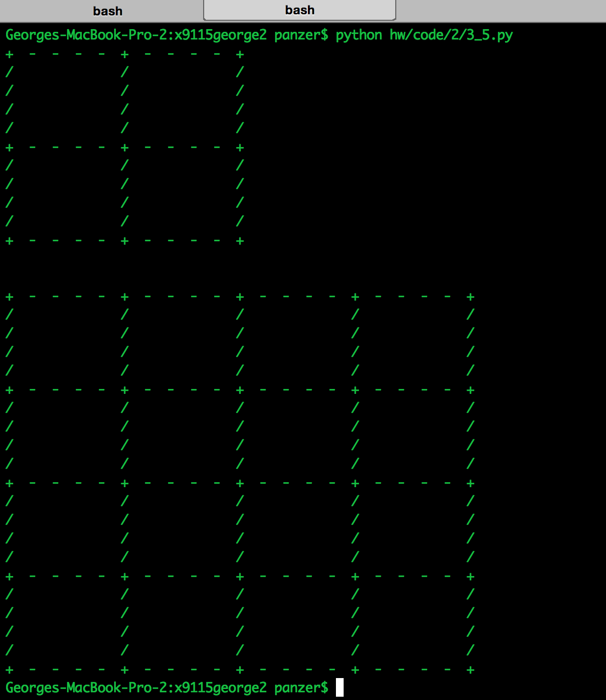
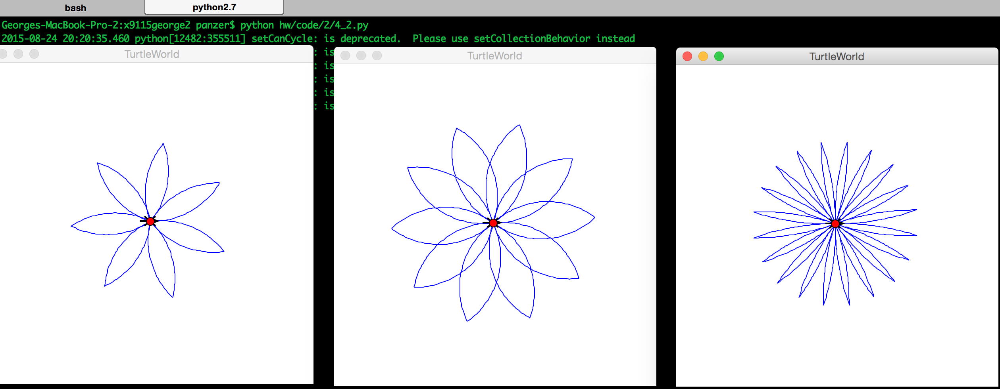
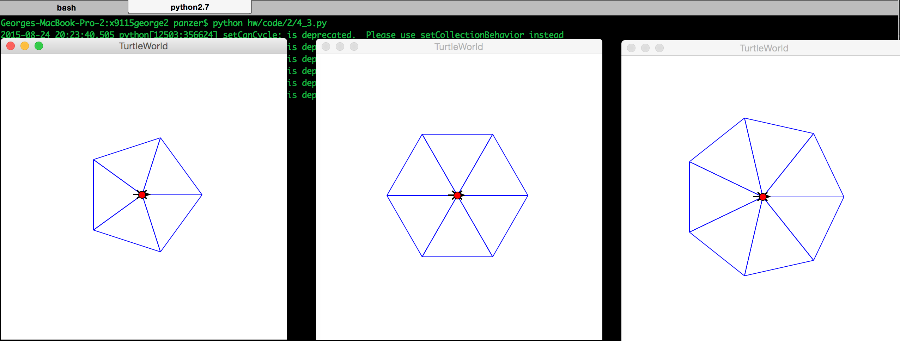

# Coding HW 2

## Exercise 3.1
Throws an error since the function is used before it is defined.

## Exercise 3.2
Program runs successfully. Executes print lyrics twice

## Exercise 3.3
Calculates the padding as 70 - length(string) and prints the output

## Exercise 3.4
* Created a function do_twice that accepts 2 arguments a function 'f' and its argument 'arg'.
* Executes f(arg) twice
* Created a function do_four that executes do_twice twice.

## Exercise 3.5
Created a generic function that creates a square that accepts number of rows as parameter. It uses a for loop to iterate decide the character based on the index.

## Exercise 4.2
* Used the existing functions(arc, polyline) provided in section to create a petal function.
* Used the petal function to construct a flower using a flower function.

## Exercise 4.3
* Used the existing functions(fd, lt) provided in section to create an isosceles triangle function.
* The sides of the triangle was computed using trigonometry and basic geometry
* Based on the number of sides provided as input, isosceles triangles were called and merged

