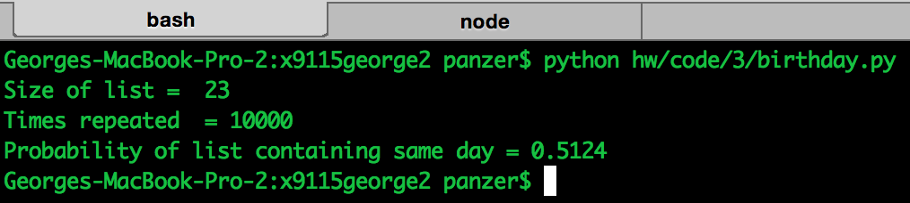
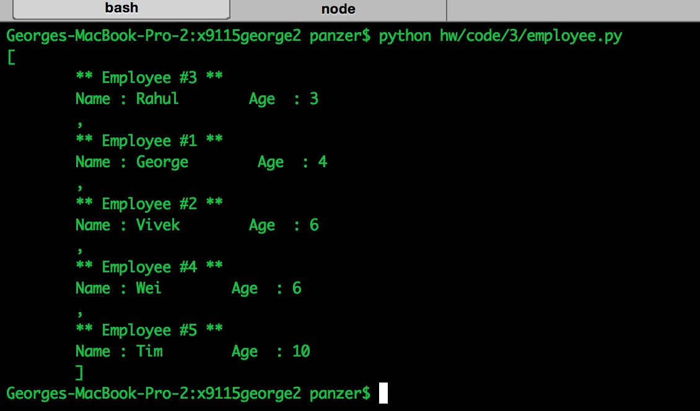
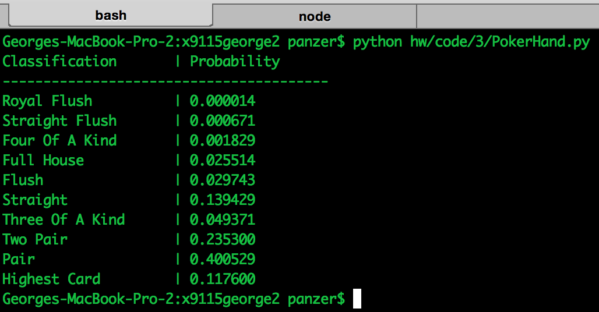

# Coding HW 3

## Birthday
Created a function that accepts 'size' of list in which random numbers between 
1 and 365 are inserted. It also actions a parameter 'repeats'. The function 
runs an interation 'repeats' times and computes the probability that a number 
is repeated. 

## Employee
Created a class 'Employee' with an 
  
  * auto increment id
  * default constructor that takes name and age
  * '__repr__' function to pretty print the class
  * '__lt__' function for comparison of 2 employees based on their ages.

## PokerHand
Created function to identify all the hands in poker, with labels assigned 
to each hand based on the precedence. Refer [this page](https://en.wikipedia.org/wiki/List_of_poker_hands) 
for precedence of hands.

  * Runs 10000 times(Can be changed in main in the program)
  * Finds the highest label for each hand
  * Estimates the probability of each label(From 'Royal Flush' to 'Highest Card')
  
