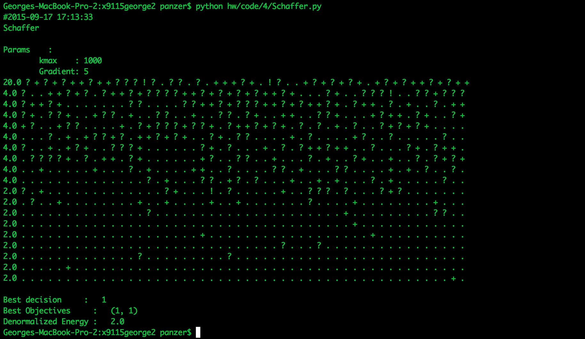

# Coding HW 4

## Schaffer
* Random runs schaffer to get the extremes for objectives
* Once objectives are obtained its fed back into another instance of schaffer.
* Simulated annealing is used on this model

