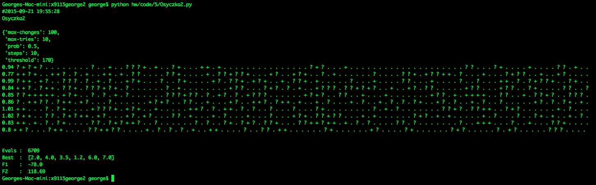

# Coding HW 5

## Osyczka2
* Random runs osyczka2 to get the extremes for objectives
* Once objectives are obtained its fed back into another instance of osyczka2.
* Max Walk Sat is used on this model

## Legend
* **?** represents a random jump and the solution changes.
* **+** represents a better solution using a local change along one dimension
* **.** represents a solution that does not change

