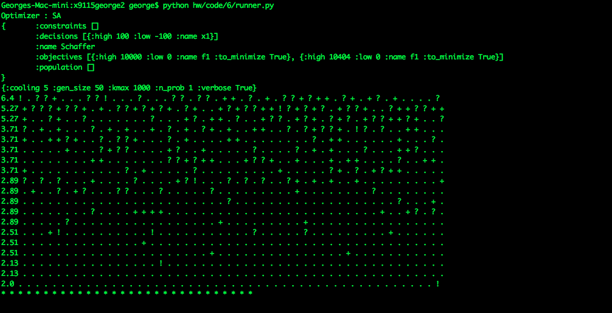
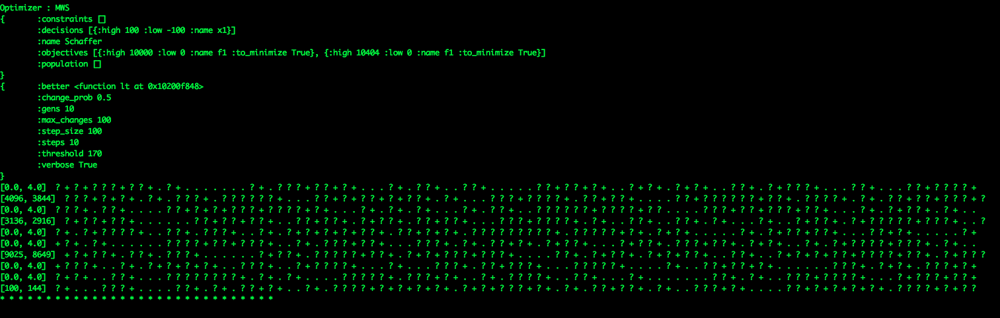
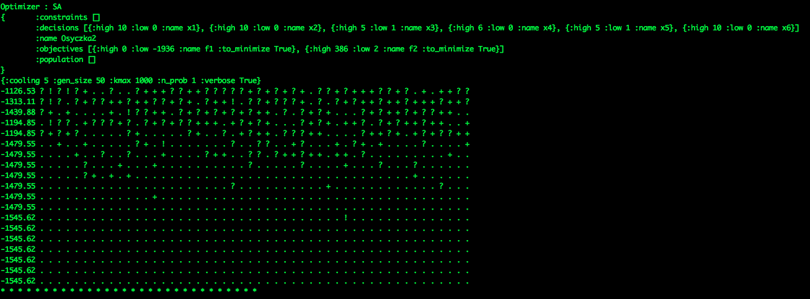
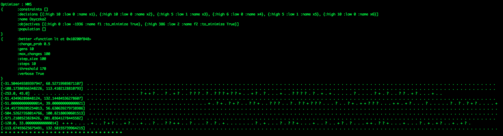
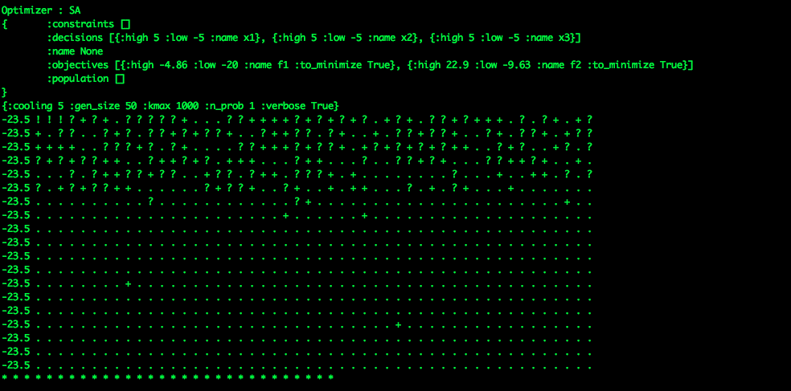
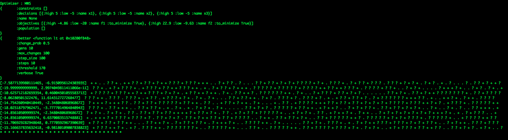

# Coding HW 6

## Algorithms
* Simulated Annealing
* Max Walk Sat

## Models
* Schaffer
* Osyczka2
* Kursawe

## Outputs
### Schaffer on Simulated Annealing

### Schaffer on Max Walk Sat

### Osyczka2 on Simulated Annealing

### Osyczka2 on Max Walk Sat

### Kursawe on Simulated Annealing

### Kursawe on Max Walk Sat

