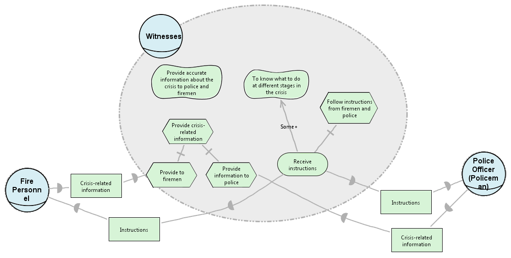

# Py* : Python Based Modelling Module For Requirements Engineering
#### - George Mathew (george2@ncsu.edu)

## Abstract
In early phase of software development, mapping functional requirements are critical
since this gives a high level insight on the feasibility of the software. UML diagrams
were used initially for modelling, but UML often focuses on organisational objects,
which are not so important in the early phase, when the emphasis should be on helping
stakeholders gain better understanding of the various possibilities for using information
systems in their organizations. The i* model was proposed in 2005 to provide an early
understanding of the organizational relationships in a business domain. The Use Case
development from organizational modeling using i* allows requirement engineers to
establish a relationship between the functional requirements of the intended system
and the organizational goals. Constructing these models using the current state of the
art (OpenOME developed in 2008) is cumbersome, time consuming and makes it hard
to perform predictive analysis and optimization on the models. In this project a simple
python based module is proposed which can be easily used to create and update the
models by the business user based on his requirements. At the same time Py* also
reduces the effort of the requirements engineer to predict the outcome of the models
and optimize for its feasibility

## I - Introduction
Modeling in the early stage of system analysis is critical for understanding stakeholders, their needs, problems, and different viewpoints. Eric Yu et.al proposed the i* framework[1] to address this modeling problem. Although the i* model helps the analyst perform comprehensive analysis on requirements, constructing the models is cumbersome and representing them in a program requires a lot of manual effort from a software developer. Py* was born out this problem and is a python based modeling language to represent the i* models which can help both the analysts and the engineers.

The following report is organized as follows; Section II gives a brief background on the i* modeling language, Section III describes Py* model, Section IV highlights the setup for our experiment on optimizing a requirements engineering model, Section V shows the results for the experiment, Section VI describes the how the model can be improved and the future work.

## II - Background
The i* framework[2] proposes an agent-oriented approach to requirements engineering centering on the intentional characteristics of the agent.  Agents attribute intentional properties (such as goals, beliefs, abilities, commitments) to each other and reason about strategic relationships.  Dependencies between agents give rise to opportunities as well as vulnerabilities.  Networks of dependencies are analyzed using a qualitative reasoning approach.  Agents consider alternative configurations of dependencies to assess their strategic positioning in a social context.
The framework is used in contexts in which there are multiple parties (or autonomous units) with strategic interests which may be reinforcing or conflicting in relation to each other.  Examples of such contexts include: business process redesign, business redesign, information systems requirements engineering, analyzing the social embedding of information technology, and the design of agent-based software systems.
The framework consists of nodes and edges with **Tasks** and **Resources** representing input nodes, while **Goals** and **SoftGoals** representing output nodes. Edges are used to propogate values from one node to another. Edges are of four types
* **Dependency** : Parent depends on child. ie If the child is satisfied, then the parent is also satisfied
* **Contribution** : Quantitates softgoals. This edge can be of 4 types: **Make**, **Help**, **Hurt** and **Break**.
* **Decomposition** : Represents logical AND edges.
* **Means-Ends** : Represents logical OR edges.
* 
The figure below highlights the model with an example


In the above figure "Restrict Structure of Password" and "Ask for Secret Question" are identified as unsatisfied and satisfied respectively. These values are propagated through the edges to compute the value of each node. The satisifability of each node is highlighted on it as the values are propogated.

## III - Py*
 Py* is developed in python where each node/edge is represented as a python class. The class hierachy with each base class followed by their child classes is as follows
 
 ```
 Component
 |.. Node
 |.. |.. Task
 |.. |.. Resource
 |.. |.. Goal
 |.. |.. Softgoal
 |.. Edge
 |.. |.. Dependency
 |.. |.. Decomposition
 |.. |.. |.. AND
 |.. |.. |.. OR
 |.. |.. Contribution
 |.. |.. |.. Make
 |.. |.. |.. Help
 |.. |.. |.. Hurt
 |.. |.. |.. Break
```

The graph is evaluated as follows:
* A node is selected at random from the graph.
* The incoming edges of the node are identified and all the child nodes are recursively evaluated.
* Two kinds of conflicts can arise while evaluating the nodes
  * The incoming edges can be conflicting. For example, one incoming edge can be **help**, while the other can be **hurt**. In such cases a random value(satisfied or unsatisfied) is assigned to the node.
  * A loop can exist. i.e While propagating through the nodes, we notice that the same node is visited again. In such cases too, a random value is assigned to the node.



A sample model shown above is represented as follows

```python
from template import *

N = Many()
# Nodes
n1 = N + SoftGoal(name = "Provide accurate Information", container="Witnesses")
n2 = N + SoftGoal(name = "To know what to do", container="Witnesses")
n3 = N + Task(name = "Follow instructions from firemen", container="Witnesses")
n4 = N + Task(name = "Provide crisis related info", container="Witnesses")
n5 = N + Task(name = "Provide to fireman", container="Witnesses")
n6 = N + Task(name = "Provide info to police", container="Witnesses")
n7 = N + HardGoal(name = "Receive instructions", container="Witnesses")
n8 = N + Resource(name = "Crisis-related information", container="Fire")
n9 = N + Resource(name = "Instructions", container="Fire")
n10 = N + Resource(name = "Instructions", container="Police")
n11 = N + Task(name = "Crisis-related information", container="Police")

E = Many()
#Edges
e1 = E + SomePlus(source = n7,target = n2)
e2 = E + Or(source = n7,target = n3)
e3 = E + And(source = n5,target = n4)
e4 = E + And(source = n6,target = n4)
e5 = E + Dep(source = n5,target = n8)
e6 = E + Dep(source = n9,target = n7)
e7 = E + Dep(source = n10,target = n7)
e8 = E + Dep(source = n6,target = n11)

graph = Graph(name="bCMS_SR_Witness", nodes=N.all, edges=E.all)
```

## IV - Experimental Setup

We perform Differential Evolution[3] on a Counselling Services model[4] which contains 263 nodes and 484 edges. The objective of the experiment is to maximize the number of softgoals satisfied, maximize the number of goals satisfied and minimize the total cost of choosing the decisions.
The rig is designed as follows:
* Each input node(Task or Resource) is assigned a random value between 1 and 5.
* Nodes are visited within the graph at random and evaluated.
* Once all nodes are evaluated, each objective is computed.
* Settings of Differential Evolution is as follows


|     Setting     |                                       Value                                      |
|:---------------:|:--------------------------------------------------------------------------------:|
|   Generations   |                                        100                                       |
|    Canditates   |                            10 * (number of decisions)                            |
|  Crossover Rate |                                        0.3                                       |
| Mutation Factor |                                       0.75                                       |
|    Objectives   | Number of Softgoals - Max<br> Number of Goals - Max<br> Total Cost of Decisions - Min<br>|
|   Random Seed   |                                         1                                        |


## V - Results
The generational ranking of the perecentage of satisfiability of softgoals is shown in the table below

```
rank ,      name ,     med   ,   iqr 
----------------------------------------------------
   1 ,      gen0 ,    54.84  ,   9.14 (   -------  *  |--            ),43.01, 51.08, 54.84, 57.53, 61.83
   2 ,     gen20 ,    59.68  ,   6.99 (           --- | *----        ),53.23, 56.99, 60.22, 62.37, 67.74
   2 ,     gen40 ,    60.22  ,   6.99 (            ---| * -----      ),54.84, 58.06, 60.75, 63.44, 69.89
   2 ,     gen60 ,    61.29  ,   7.52 (            ---| *  -----     ),54.84, 58.06, 61.29, 64.52, 71.51
   3 ,     gen80 ,    62.37  ,   7.53 (              -|  *  -----    ),56.99, 59.68, 62.37, 65.59, 72.58
   3 ,    gen100 ,     62.9  ,   6.99 (               |-  * -----    ),57.53, 60.22, 63.44, 65.59, 72.58
```
The table ranks the median and Inter-Quartile Range(IQR) of generations 0-100 at intervals of 20 generations using Scott-Knott technique suggested by Mittas & Angelis[5]. To rank the generations, A12 statistical test[6] along with bootstrap sampling was used.
Column 1 represents the rank of the generation, Column 2 represents the name of the generation, Columns 3 and 4 represent the median and IQR of the percentage of softgoals satisfied, Column 5 represents the quartile chart. "__*__" represents the median value, the blank spaces between __-__ and __*__ represents the 25th to 75th percentile and __-__ represents the 10th to 25th percentile and 75th to 90th percentile. Columns 6 through 10 represents values at 10%, 30%, 50%, 70% and 90% respectively.

The table below represents the generational ranking of the percentage of satisfiability of goals
```
rank ,      name ,    med   ,   iqr 
----------------------------------------------------
   1 ,      gen0 ,    69.57  ,  30.43 (--           * |  -------     ),43.48, 47.83, 69.57, 78.26, 91.30
   2 ,     gen20 ,    78.26  ,  13.04 (-------------  |  * -----     ),43.48, 69.57, 78.26, 82.61, 91.30
   2 ,     gen40 ,    78.26  ,  13.04 (      ---------|  * -----     ),56.52, 73.91, 78.26, 82.61, 91.30
   2 ,     gen60 ,    78.26  ,    8.7 (      ---------|  * -----     ),56.52, 73.91, 78.26, 82.61, 91.30
   2 ,     gen80 ,    78.26  ,  13.05 (             --|  * -------   ),69.57, 73.91, 78.26, 82.61, 95.65
   2 ,    gen100 ,    78.26  ,  13.05 (             --|  * -------   ),69.57, 73.91, 78.26, 82.61, 95.65
```

The table below represents the generational ranking of the costs of making the decisions
```
rank ,        name ,    med   ,   iqr 
----------------------------------------------------
   1 ,      gen100 ,     64.0  ,   13.0 (    ----  * ---|              ),53.00, 60.00, 64.00, 69.00, 77.00
   1 ,       gen80 ,     65.0  ,   11.0 (     ----  * --|              ),54.00, 62.00, 66.00, 70.00, 77.00
   1 ,       gen60 ,     66.0  ,   10.0 (      ---  * --|---           ),56.00, 63.00, 66.00, 71.00, 82.00
   2 ,       gen40 ,     68.0  ,   12.0 (      ----  *  |----          ),56.00, 64.00, 68.00, 75.00, 84.00
   2 ,       gen20 ,     69.0  ,   14.0 (      ----   * |-----         ),56.00, 64.00, 70.00, 75.00, 86.00
   2 ,        gen0 ,     75.0  ,   14.0 (       ----    * -----        ),59.00, 66.00, 75.00, 79.00, 88.00
```

As we can see, as the number of generations increases, the percentage of softgoals increases. The percentage of goals satisfied plateaus after 20 generations while the cost required to make the decisions reduces as the number of generations increases. Thus we can see that Differential Evolution can be seen to optimize the Requirement Engineering model

## VI - Future Work
The modeling language can be extended to handle
* Extend model to support Agents and Actors
* Support for other optimizers like NSGA2, IBEA etc
* Model evaluation can be expensive hence optimization should be parallelized.


## Acknowledgements
This report is part of CSC-791 Automated Software Engineering. I would like to express my gratitude towards the instructor Dr Tim Menzes and the Teaching Assisant Rahul Krishna for the their support in pursuing this project. Additionally, I would like to thank the instructor for allowing me to use his script for scott-knott test.

## References
[1] Yu, E. Towards Modelling and Reasoning Support for Early-Phase Requirements Engineering. Proceedings of the 3rd IEEE Int. Symp. on Requirements Engineering (RE'97) Jan. 6-8, 1997, Washington D.C., USA. pp. 226-235.

[2] _i*_, URL: http://www.cs.toronto.edu/km/istar/

[3] R. Storn, and K. Price, "Differential Evolution: A Simple and Efficient Heuristic for Global Optimization Over Continuous Spaces", in Journal of Global Optimization, vol. 11, no. 4, pages 341-359, December, 1997

[4] CS Counselling Service, URL: http://tiny.cc/cs_services

[5] Nikolaos Mittas and Lefteris Angelis.  Ranking and clustering softwarecost estimation models through a multiple comparisons algorithm.IEEETrans. Software Eng., 39(4):537–551, 2013.

[6] Andras Vargha and Harold D. Delaney, "A Critique and Improvement of the CL Common Language Effect Size Statistics of McGraw and Wong", in Journal of Educational and Behavioural Statistics, vol 25, no. 2, pages 101-132, June 2000
