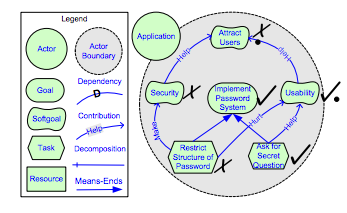

# Py* : Python Based Modelling Module For Requirements Engineering
#### - George Mathew (george2@ncsu.edu)

## Abstract
In early phase of software development, mapping functional requirements are critical
since this gives a high level insight on the feasibility of the software. UML diagrams
were used initially for modelling, but UML often focuses on organisational objects,
which are not so important in the early phase, when the emphasis should be on helping
stakeholders gain better understanding of the various possibilities for using information
systems in their organizations. The i* model was proposed in 2005 to provide an early
understanding of the organizational relationships in a business domain. The Use Case
development from organizational modeling using i* allows requirement engineers to
establish a relationship between the functional requirements of the intended system
and the organizational goals. Constructing these models using the current state of the
art (OpenOME developed in 2008) is cumbersome, time consuming and makes it hard
to perform predictive analysis and optimization on the models. In this project a simple
python based module is proposed which can be easily used to create and update the
models by the business user based on his requirements. At the same time Py* also
reduces the effort of the requirements engineer to predict the outcome of the models
and optimize for its feasibility

## I - Introduction
Modeling in the early stage of system analysis is critical for understanding stakeholders, their needs, problems, and different viewpoints. Eric Yu et.al proposed the i* framework[1] to address this modeling problem. Although the i* model helps the analyst perform comprehensive analysis on requirements, constructing the models is cumbersome and representing them in a program requires a lot of manual effort from a software developer. Py* was born out this problem and is a python based modeling language to represent the i* models which can help both the analysts and the engineers.

The following report is organized as follows; Section II gives a brief background on the i* modeling language, Section III describes Py* model, Section IV highlights the setup for our experiment on optimizing a requirements engineering model, Section V shows the results for the experiment, Section VI describes the how the model can be improved and the future work.

## II - Background
The i* framework[2] proposes an agent-oriented approach to requirements engineering centering on the intentional characteristics of the agent.  Agents attribute intentional properties (such as goals, beliefs, abilities, commitments) to each other and reason about strategic relationships.  Dependencies between agents give rise to opportunities as well as vulnerabilities.  Networks of dependencies are analyzed using a qualitative reasoning approach.  Agents consider alternative configurations of dependencies to assess their strategic positioning in a social context.
The framework is used in contexts in which there are multiple parties (or autonomous units) with strategic interests which may be reinforcing or conflicting in relation to each other.  Examples of such contexts include: business process redesign, business redesign, information systems requirements engineering, analyzing the social embedding of information technology, and the design of agent-based software systems.
The framework consists of nodes and edges with **Tasks** and **Resources** representing input nodes, while **Goals** and **SoftGoals** representing output nodes. Edges are used to propogate values from one node to another. Edges are of four types
* **Dependency** : Parent depends on child. ie If the child is satisfied, then the parent is also satisfied
* **Contribution** : Quantitates softgoals. This edge can be of 4 types: **Make**, **Help**, **Hurt** and **Break**.
* **Decomposition** : Represents logical AND edges.
* **Means-Ends** : Represents logical OR edges.
* 
The figure below highlights the model with an example

In the above figure "Restrict Structure of Password" and "Ask for Secret Question" are identified as unsatisfied and satisfied respectively. These values are propagated through the edges to compute the value of each node. The satisifability of each node is highlighted on it as the values are propogated.

## III - Py*

## IV - Experimental Setup

## V - Results

## VI - Future Work

## Acknowledgements

## References
[1] Yu, E. Towards Modelling and Reasoning Support for Early-Phase Requirements Engineering. Proceedings of the 3rd IEEE Int. Symp. on Requirements Engineering (RE'97) Jan. 6-8, 1997, Washington D.C., USA. pp. 226-235.

[2] _i*_, http://www.cs.toronto.edu/km/istar/
